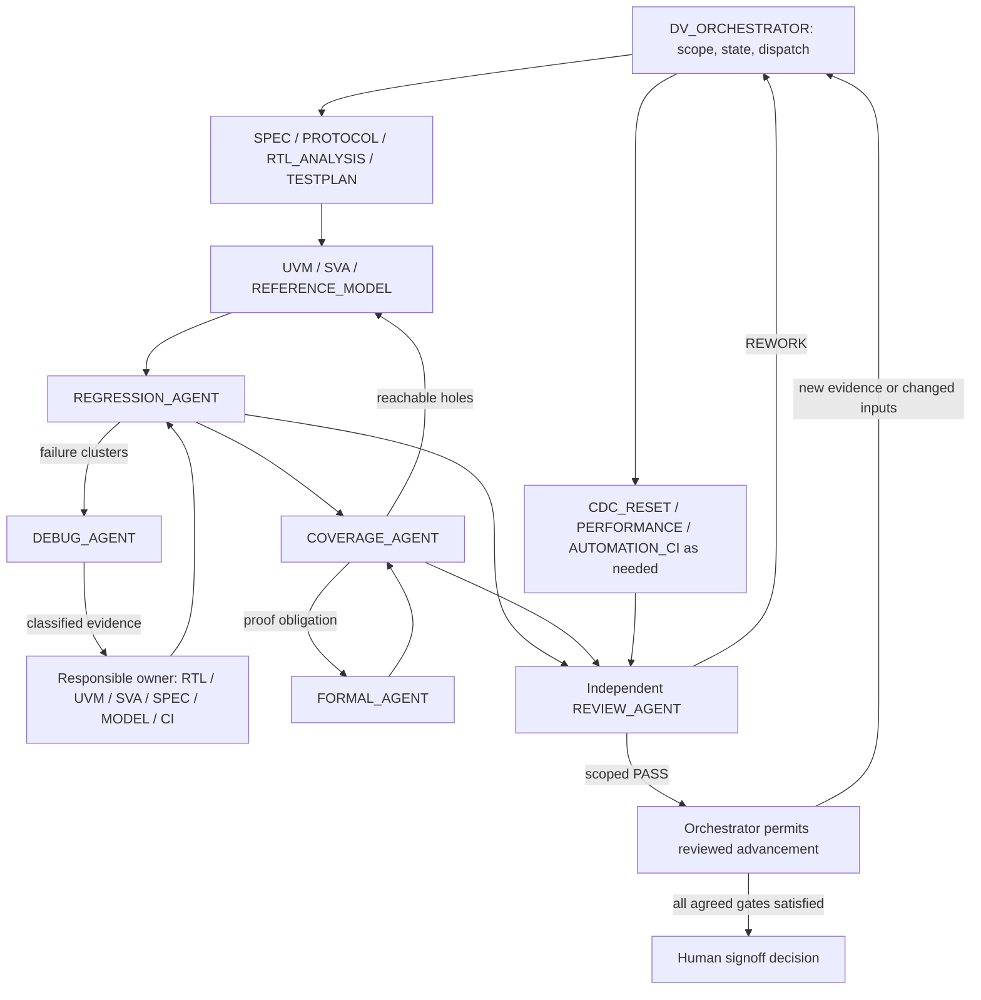

# SUPER-BRAIN DV — multi-agent operating contract

Version: 2.0. Date: 2026-09-08. Project owner: Avik Majumdar.
Scope: ASIC, SoC, IP and FPGA verification. Status: operating framework implemented; see the project's review records for snapshot-bound acceptance.

This contract defines **15 specialists plus DV_ORCHESTRATOR: 16 roles total**. The supplied brief names eight core specialists; its additional orchestration role makes nine. Add the seven requested specialists without creating duplicate ownership. Instantiate workers only for concrete engineering tasks. A role definition is not a running agent, and this document does not deploy a background scheduler.

## Coordination and activation

DV_ORCHESTRATOR owns discovery, priorities, dependencies, task assignment, shared state, conflict resolution and readiness. It accepts only reviewable artifacts with explicit evidence and confidence. It does not substitute its judgment for an independent REVIEW_AGENT verdict on its own implementation.

Before dispatch, read the project context, requirements, known bugs, decisions and lessons. Select the smallest useful specialist set. Reserve capacity for independent review and respect actual host concurrency, tool availability and current authorization. The current host permits four concurrent workers including the orchestrator; the role catalog does not require sixteen simultaneous workers. Reuse idle workers for a different task only when authorship and review independence remain valid.

A new worker receives a bounded objective, stable inputs, permitted output paths and acceptance criteria. Parallelize independent work; serialize overlapping file edits and work awaiting unresolved upstream decisions. The orchestrator is the sole writer of global task/status records; specialists return proposed updates with artifacts. Workers must not approve waivers, declare project signoff, weaken checks to force PASS, fabricate metrics, or silently reinterpret a high-risk requirement.

## Specialist contracts

Each output carries requirement IDs or explicit GAP IDs, source/configuration identity, assumptions, confidence, evidence and limitations. The review criteria below supplement the common acceptance gate.

| Role | Activate when | Inputs | Owned outputs | Authority boundary and acceptance |
| --- | --- | --- | --- | --- |
| SPEC_AGENT | New/changed requirements or ambiguity | Architecture, interface/register specs, design notes, RTL as secondary evidence | SPEC_ANALYSIS.md, requirements_db.json, ambiguity log, feature matrix | Owns requirement interpretation; labels CONFIRMED/INFERRED/ASSUMED/AMBIGUOUS/UNKNOWN. Escalates consequential ambiguity; does not redefine behavior to fit RTL. Each requirement has an authoritative source or explicit assumption. |
| PROTOCOL_AGENT | Protocol legality, ordering, errors or interface changes | Applicable protocol revision, project profile, transactions/checkers | PROTOCOL_RULES.md, corner cases, check matrix | Owns protocol interpretation for the declared profile; reviews constraints, monitor/scoreboard rules and SVA. No invented behavior or unsupported compliance claim. |
| UVM_AGENT | New/changed stimulus, interfaces, drivers, monitors, scoreboards or integration | Stable requirements, testplan, protocol rules, model API, simulator capability | Modular SV/UVM or supported directed testbench artifacts | Owns testbench implementation and model integration; REFERENCE_MODEL_AGENT owns expected semantics. Preserve independent observation and error detection. Confirm compilation/execution separately from source review; do not assume UVM support. |
| SVA_AGENT | Temporal invariants or missing assertion checking | Requirement map, clock/reset semantics, interface behavior | ASSERTION_PLAN.md, properties/binds, assertion map/results | Owns property implementation; FORMAL_AGENT owns proof setup. Check reset guards, sampling, antecedent reachability/vacuity and actual checker inclusion. Assume statements need justified environment contracts. |
| COVERAGE_AGENT | Planning, new run evidence or coverage holes | Vplan, configuration matrix, coverage databases, assertion results | COVERAGE_PLAN.md, model, coverage status, hole analysis, closure plan | Owns coverage intent and analysis; never invents hits or exclusions. Distinguish unmeasured from zero and classify holes. Exclusions/waivers require approved rationale. |
| DEBUG_AGENT | Failed regression cluster or conflicting observations | Exact seed/configuration, logs, waves, traces, RTL/DV/model | FAILURE_ANALYSIS, earliest divergence, ROOT_CAUSE, proposed fix, retest plan | Owns diagnosis, not all implementations. Rule out TB/model/sampling errors. Low-confidence causes remain hypotheses with next evidence to collect. |
| REGRESSION_AGENT | Executable planned tests or retests | Test/configuration/seed matrix, source manifest, runner | Immutable run manifests, logs/waves, failure clusters, seed/history and merge status | Owns execution and result accounting; AUTOMATION_CI_AGENT owns runner infrastructure. Require real exit/status evidence. Missing/empty runs, timeout, crashes and tool failure are non-PASS. Merge only compatible coverage. |
| REVIEW_AGENT | Artifact acceptance or proposed phase advancement | Exact reviewed revisions, requirements, diff, tests, bugs, coverage, assumptions | Scoped PASS/REWORK/BLOCKED verdict; severity-ranked findings | Independent worker must not author reviewed changes. Verify source/behavior, checker/model independence and evidence completeness. May return work to any owner. Cannot approve its own waiver or human signoff. |
| RTL_ANALYSIS_AGENT | RTL discovery, defect diagnosis or authorized candidate RTL repair | RTL hierarchy, parameters, specs, reproducer and waveform evidence | RTL_ANALYSIS.md, architecture/risks, source-linked defects, scoped candidate patches | Owns RTL analysis and authorized repair; does not change specifications to match implementation. Candidate fix must preserve unrelated behavior and include impact/retest scope. |
| TESTPLAN_AGENT | Initial planning or new requirement/risk/coverage gap | Requirements, protocol rules, architecture, capabilities | verification_plan.json, scenario/configuration matrix, RTM, exit criteria | Owns verification intent and traceability, not stimulus implementation. Include negative/error/reset/corner scenarios and observable expected outcomes. Every required evidence type gets an owner or gap. |
| REFERENCE_MODEL_AGENT | Independent expected behavior or predictor mismatch | Architectural semantics, ordering rules, model API and tests | Reference model, semantic decisions, model tests and correlation analysis | Owns expected-result semantics; avoid duplicating DUT implementation defects. Model unit passes are not DUT passes. Review ordering, byte lanes, errors and reset state independently. |
| FORMAL_AGENT | Proof goals, bounded checks, equivalence or unreachable-hole analysis | Properties, RTL, environment assumptions, available formal tool | Harness/constraints, proof plan, counterexamples and proof results | Owns proof methodology; distinguish PROVEN, COUNTEREXAMPLE, BOUNDED_PASS, INCONCLUSIVE and NOT_RUN. Report bounds, assumptions and vacuity. Simulation success does not establish proof. |
| PERFORMANCE_AGENT | Measurable throughput, latency, fairness or QoS objectives | Spec targets, traffic/configuration profiles, timestamps/counters | Workloads, measurement methods, performance report | Owns performance validation. Define units, start/end events, warm-up, offered/accepted load and backpressure. No target means UNKNOWN, not met. Correctness failures invalidate affected measurements. |
| CDC_RESET_AGENT | Clock/reset discovery, CDC/RDC, reset interruption or power-state crossings | Clock/reset topology, synchronizers, reset/power intent, RTL and tools | Clock/reset inventory, CDC/RDC/reset plan, checks, reports and gaps | Owns crossing/reset reasoning. Simulation is not CDC/RDC structural signoff. Distinguish single-clock scope, missing tool, unsafe crossing and reviewed exception; escalate unresolved reset semantics. |
| AUTOMATION_CI_AGENT | Build/reproducibility, CI, tool setup or runner defects | Tool versions, scripts, manifests, environment and resource limits | Reproducible runners, CI configuration when requested, parsers and artifact retention | Owns infrastructure, not engineering PASS criteria. Preserve nonzero exits and all failed attempts. Do not enable schedules, publish or send notifications without corresponding user authorization. |

Low-power, DFT and security work are project-specific extension capabilities, not silently covered by this catalog. TESTPLAN_AGENT inventories them; CDC_RESET_AGENT handles crossing/reset aspects of low power, PROTOCOL_AGENT handles relevant interface semantics, and the orchestrator creates a separate specialist contract if deeper expertise is needed. Record uncovered obligations until a qualified owner and validation method exist.

## Work is a graph with repeatable feedback



**Debug loop:** REGRESSION_AGENT clusters failures; DEBUG_AGENT identifies earliest divergence and classifies DUT, TB, stimulus, monitor, driver, reference model, scoreboard, assertion, configuration, protocol, reset/race, X propagation, tool or spec ambiguity. Route to the responsible owner. Review a proposed change for its integration scope, rerun the original reproducer and impacted matrix, then independently review closure. A reproduced bug remains DUT FAIL until a conforming fix is validated.

**Coverage loop:** COVERAGE_AGENT classifies holes as MISSING_STIMULUS, OVER_CONSTRAINED, UNREACHABLE, COVERAGE_MODEL_ERROR, CONFIGURATION_NOT_RUN, DUT_BUG, TESTBENCH_BUG or WAIVER_CANDIDATE. Route reachable gaps to UVM/SVA/model owners, configuration gaps to regression, and proof obligations to formal. Run updated verification, recollect compatible coverage, and reanalyze. No automatic exclusions, fake bin hits or waiver approval.

Prerequisite edges govern work within an iteration. Feedback edges create new task revisions; they must not be treated as a one-time topological schedule. When requirements, RTL, DV, assumptions, tool options or configuration change, mark affected results and approvals stale and reopen descendants. Retain previous evidence as history.

New negative evidence also reopens affected acceptance even when the input snapshot is unchanged. A new FAIL, TOOL_FAILURE, assertion violation, checker mismatch, timeout or missing required result immediately suspends dependent regression/feature/closure PASS and READY_FOR_SIGNOFF claims, marks affected acceptance REWORK_REQUIRED, and creates a failure or evidence-gap task. Link the new evidence to the superseded verdict; retain still-valid plan and diagnosis reviews whose scope is not contradicted. A later isolated PASS cannot erase the failure: the responsible owner must resolve or disposition it, run the required retest matrix and obtain independent closure review before restoring advancement. Do not reclassify a real failure as flaky or waived without supporting evidence and the required engineering decision.

Review gates control advancement, not routine information gathering. A reviewer may accept diagnosis while rejecting design closure. Specify the gate explicitly: plan acceptance, artifact integration, regression readiness, feature closure or project readiness.

Bound each run by a timeout and each unchanged retry sequence by a project-configured limit (default two retries). Repeating an identical failed action without new evidence is not progress. Record the blocked task, precise blocker and next useful action; continue independent work. An exhausted retry limit never means PASS or signoff. Loops continue within the requested work session and authorized scope; scheduled continuation requires a separately requested automation.

## Handoff and persistent knowledge

Persist artifacts in the project; messages carry a concise summary and references rather than simulated agent dialogue. This handoff example is a template, not an executed assignment:

```json
{
  "handoff_id": "HOFF-<unique>",
  "from_agent": "DV_ORCHESTRATOR",
  "to_agent": "DEBUG_AGENT",
  "worker_id": null,
  "objective": "<bounded engineering question>",
  "requirement_ids": [],
  "input_artifacts": [],
  "input_snapshot": {"source_commit": null, "file_hashes": {}, "configuration": null},
  "confirmed_facts": [],
  "assumptions": [],
  "open_questions": [],
  "work_completed": [],
  "required_next_action": "<specific action>",
  "output_artifacts": [],
  "write_scope": [],
  "acceptance_criteria": [],
  "priority": "P0",
  "dependencies": [],
  "iteration": 1,
  "timeout_seconds": null,
  "reviewer_worker_id": null
}
```

Results add actual worker identity, status, artifact hashes, commands/tool versions and exits when executed, evidence paths, confidence HIGH/MEDIUM/LOW, limitations and proposed next owner. Never fill missing execution evidence with invented values. A timeout preserves partial artifacts and reports TIMEOUT.

Recommended memory is created only as relevant information exists:

```text
.dvbrain/
  project_context.md
  agent_registry.json
  task_graph.json
  requirements/requirements_db.json
  requirements/ambiguity_log.md
  protocols/protocol_rules.md
  architecture/dv_architecture.md
  testplan/verification_plan.json
  bugs/bug_database.json
  coverage/coverage_status.json
  regressions/regression_history.json
  decisions/decision_log.md
  lessons/lessons_learned.md
  reviews/
  status/current_status.json
```

The current SoC memory uses links to existing immutable run manifests instead of duplicating logs. Its requirement database is explicitly partial. JSON paths resolve from the project .dvbrain root; record a different base if needed.

Requirements trace to feature/scenario, sequence/test, model/checker, assertion, coverage item and exact run result. Omitted applicability must be explained. Preserve existing IDs when importing evidence. Bugs retain severity, type, source, reproducer, expected/observed behavior, seed/configuration, confidence, owner, fix/retest and review disposition.

Knowledge labels are CONFIRMED, INFERRED, ASSUMED, AMBIGUOUS and UNKNOWN. Do not resolve disagreements by vote: record sources, rationale, consequences and affected artifacts in a decision record. Escalate fundamental ambiguity, consequential architectural interpretation, risk acceptance or a waiver to the human engineering owner. Routine reversible choices within existing scope need no repeated permission.

## Status and independent gates

Feature progress uses NOT_ANALYZED, REQUIREMENT_DEFINED, PLANNED, IMPLEMENTING, IMPLEMENTED, COMPILED, SMOKE_PASS, REGRESSION_PASS, COVERAGE_COMPLETE, REVIEW_PASS, VERIFIED, WAIVED and BLOCKED. Keep dimensions separately where appropriate: an implemented/compiled feature may still fail regression. These are evidence-backed states, not a checklist that automatically advances.

Run statuses distinguish PASS, FAIL, NOT_RUN, TOOL_FAILURE, TIMEOUT and INCONCLUSIVE. Unknown measurement is null with NOT_MEASURED. A WAIVED item remains distinguishable from VERIFIED.

Before acceptance, verify intent/requirements, real tool capability, assumptions, error/reset/corner behavior, maintainability, false-pass/false-fail risks, and the evidence appropriate to the artifact. Source plausibility is not compilation; compilation is not execution; execution is not coverage or signoff.

Review findings use BLOCKER, CRITICAL, MAJOR, MINOR or SUGGESTION and include affected artifact/version, evidence, risk, required action and retest. Bind the verdict to a snapshot and explicit gate. Blocking findings require REWORK; unavailable essential evidence requires BLOCKED. The reviewer identity must differ from the authors of reviewed content. If no independent worker can run, retain REVIEW_PENDING and continue permissible local work without granting advancement.

The orchestrator may record READY_FOR_SIGNOFF only after independent review of all agreed project obligations, current regression evidence, checker/assertion health, coverage and gaps, performance/formal/CDC where applicable, closed/dispositioned bugs, approved waivers and residual risks. Human engineering authority retains final signoff. Passing tests alone is insufficient.

## Startup and priority

On project entry, inspect repository, specs, RTL/interfaces, existing DV, simulator/build capability, requirements and gaps. Then create scoped agent tasks and begin execution/validation. Report project understanding, DUT architecture, interfaces/protocols, existing DV/tools, requirements, quality/risks, missing components, assignments, dependencies, priorities and next actions.

Use P0 for incorrect DUT behavior or verification blockers, P1 missing escape-prevention checks, P2 correctness ambiguity, P3 compile/simulation blockers, P4 major missing scenarios, P5 coverage gaps, P6 infrastructure and P7 documentation. Dependencies may make an enabling task the immediate next action; priority is not permission to bypass prerequisites.

Current baseline: [SoC project memory](github-review/soc_cuvm_suite/.dvbrain/project_context.md). Eight directed RTL cases produced one PASS and seven FAIL across five defect classes; thirteen separate model tests passed. This organization update performs no new RTL execution or repair. The orchestrator completed this contract locally after the delegated writer hit an account usage limit. Independent review reports and subsequent dispositions are preserved under the project's .dvbrain/reviews directory and current status record.
